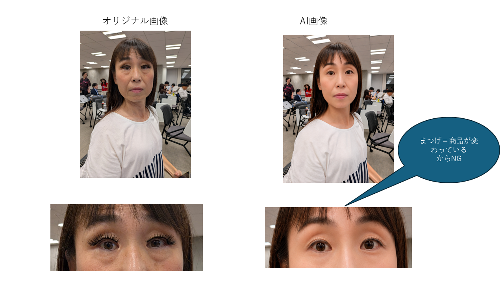
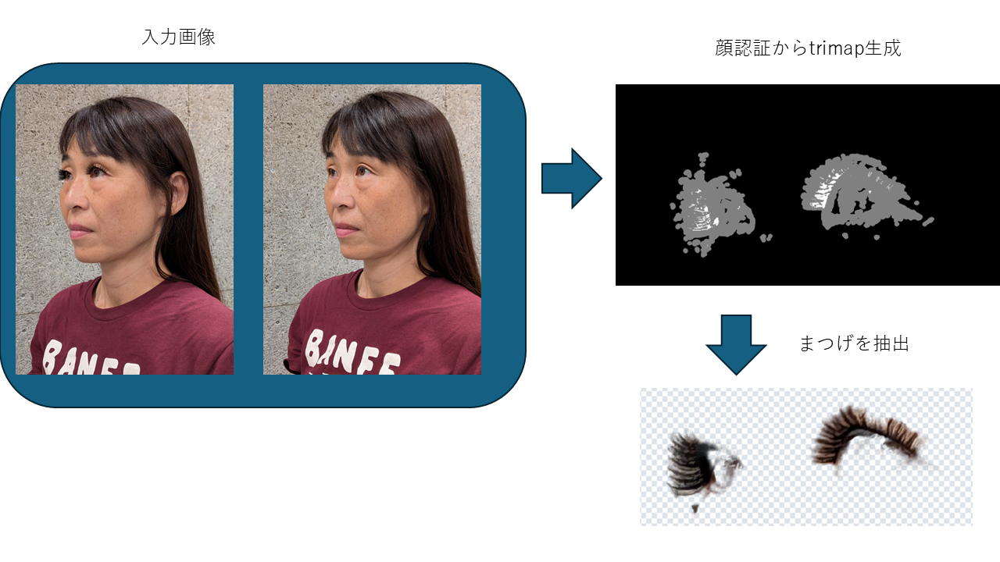
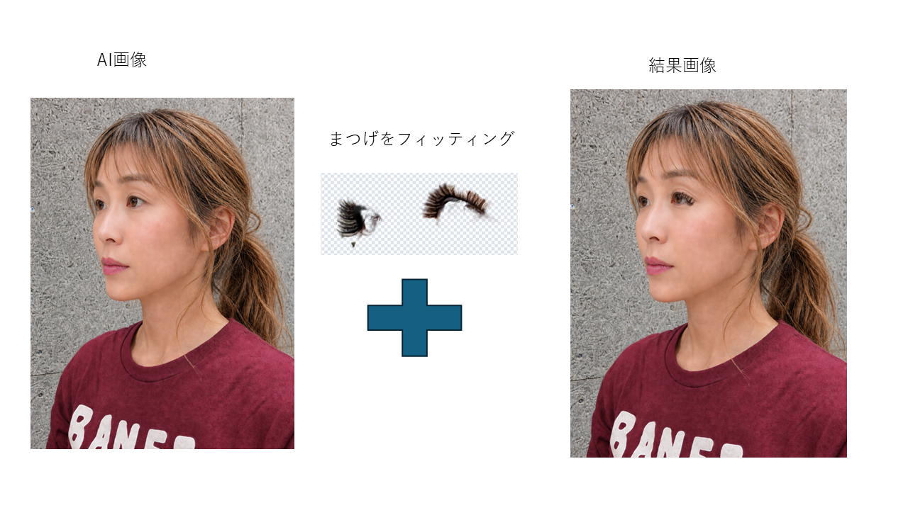

[English](README.md) | [日本語](README.ja.md)

# matuge-change

**商品はそのまま、人だけAIモデルへ。**

実際の商品まつ毛を着用した画像・動画から、商品外観をできるだけ維持したまま人物側を
AIモデルへ変更する、EC販売者向けWebアプリのPoC。

- [デモ動画（YouTube）](https://www.youtube.com/watch?v=hN2X6LOEeXA)
- [公開デモ](https://matuge-change.onrender.com/)
- [プロジェクトの背景](docs/project-background.md)

## 解決する問題

つけまつげは、毛の長さ、毛束、間隔、カール、目尻の広がり、装着位置によって着用時の印象が
変わる。ECの商品画像では、見た目が似ているだけでなく、実際に販売する商品を正しく見せる必要が
ある。

しかし、着用人物を生成AIで変更すると、人物と一緒に目元も再生成され、商品まつ毛まで別の形に
変わることがある。



そこでMatsuge Changeは、商品を生成AIに正しく描かせるのではなく、商品領域を生成AIの処理から
分離する。

```text
元画像 / 元動画
   │
   ├─ 商品領域 ──────────────┐
   │      抽出・保持          │
   │                         │
   └─ 人物領域               │
          ↓                  │
       生成AIで加工           │
          ↓                  │
          └──────────────→ 再合成
```

汎用の画像生成AIへ商品まつ毛の切り抜きを直接依頼した結果は、セグメンテーションではなく商品の
再生成になった。実例は[生成AIへ単純に切り抜きを依頼した失敗例](docs/generative-ai-cutout-failure.md)
に記録している。

## 処理方式

静止画と動画では、時間方向の一貫性やまばたきへの対応が異なるため、別の保持方式を使う。

| モード | 商品を保持する方法 | 出力 |
| --- | --- | --- |
| 静止画 | 目元ROIから商品をAlpha Matteとして抽出し、AI加工画像へ相似変換とAlpha合成で貼り戻す | PNG |
| 動画 | 元動画の目元領域をフレームごとに保持し、AI加工画像側を顔位置へ合わせて合成する | MP4 |

### 静止画

装着画像とAI加工済み画像を入力し、顔ランドマーク、Evidence、Trimap、Closed-form Alpha
Mattingを使ってProduct RGBAを作る。自動抽出で不足する部分は3値ブラシ（商品・中間・背景）で
補正できる。横顔や目のアップには手動ROIを使う。

```text
装着画像 → 目元ROI → Evidence → Trimap → Alpha Matting
                                              ↓
AI加工済み画像 ← 相似変換 + Alpha合成 ← Product RGBA
```





詳細: [静止画アルゴリズム](docs/static-image-algorithm.md) / [簡易モード仕様](docs/static-image-simple-mode.md)

### 動画

全フレームから目が開いていて鮮明なベストフレームを選び、その1枚を外部AIで人物加工する。
各フレームではAI加工画像を顔位置へ追従させ、元動画の目元領域をまつげ、まぶた、まばたきごと
貼り戻す。毎フレーム独立のAlpha抽出はちらつくため行わない。

```text
元動画 → ベストフレーム選択 → 外部AIで人物加工
   ↓                              ↓
各フレームの目元領域 ─────→ 顔追従 + 合成 → MP4
```

詳細: [動画アルゴリズム](docs/video-algorithm.md) / [動画方式の判断](docs/video-approach.md)

## 商品保持の定義

本プロジェクトの **Generative Product Preserve** は、商品まつ毛を生成AIに描き直させず、
実物画像由来の商品外観を可能な限り保持して再利用する、という意味である。

- 静止画の商品領域に許す変換は、移動、縦横比固定の拡縮、回転、反転からなる相似変換だけ
- 自由変形、パースペクティブ、非相似warp、生成AIによる商品の補完は行わない
- 動画では商品を含む元目元領域に幾何変換を掛けず、AI加工画像側だけを変形する
- 顔と目元の検出にはMediaPipe Face Landmarkerを使う
- 静止画は前景色推定と補間、動画は境界featherとH.264再エンコードを通る
- したがって、最終出力が元画像とピクセル単位で一致するという保証ではない

保証範囲と設計判断の詳細は[設計思想](docs/design-philosophy.md)を参照。

## 現在できること

- 装着画像とAI加工済み画像から抽出・再合成まで行う静止画簡易モード
- 顔ランドマークによる自動ROIと、横顔・クローズアップ用の手動ROI
- Probability、Trimap、Alpha、Product RGBAなどの診断レイヤー
- 3値ブラシ、Undo/Redo、閾値、相似変換による詳細調整
- セッションの保存・再開と実行履歴
- 抽出済み商品まつ毛のカタログ登録と形状類似検索
- 動画のベストフレーム選択、顔追従、目元領域保持、MP4出力
- ローカル保存と、任意のSupabase連携
- Synthetic Benchmarkによる回帰測定

PoCでは、Amazonで実際に販売している
[つけまつげ1種類](https://www.amazon.co.jp/dp/B0GFJSHBWT)に対象を絞っている。

## クイックスタート

DockerまたはWSL2を推奨する。PythonやMediaPipeモデルをホストへ用意せず起動できる。

```bash
git clone https://github.com/okajun35/matuge-change.git
cd matuge-change
docker compose up --build
```

`docker compose ps` が `healthy` になったら、<http://localhost:8000> を開く。初回は依存関係の
取得とMediaPipe・numbaの読み込みに時間が掛かる場合がある。

| URL | 画面 |
| --- | --- |
| `/` | 商品カタログ |
| `/extract.html` | 静止画モード |
| `/video.html` | 動画モード |

抽出結果とカタログはホスト側の `./data` に残る。詳しいセットアップ、ローカルPython環境、
テスト方法は[開発環境と品質チェック](docs/development.md)を参照。

## 基本的な使い方

### 静止画

通常は `/extract.html` の簡易モードを使う。

1. 商品まつ毛を着けた「装着画像」と、人物側を変更した「AI加工済み画像」を選ぶ
2. 「処理を実行」で解析、Matting、再合成を一括実行する
3. 装着元との比較を確認し、完成PNGを保存する
4. 抽出や位置が不十分なら「詳細調整」でROI、3値ブラシ、閾値、位置合わせを修正する

未装着画像は必須ではなく、詳細調整で任意入力として使える。自動顔検出に向かない横顔・目の
アップでは、ROI-A（抽出元）とROI-B（貼り付け先）を手動指定する。

### 動画

1. `/video.html` で商品まつ毛を着けた動画を解析する
2. 選ばれたベストフレームを保存する
3. 外部AIで人物を加工する。このとき目元を変えないよう指示する
4. AI加工済み画像をアップロードして動画を合成する
5. プレビューを確認し、MP4を保存する

## 品質評価

`evaluation/` には、正解MaskとAlphaが既知の合成データでproductionコードを測るSynthetic
Benchmarkがある。数値は次の3層に分けて扱う。

- **A**: コードパスの性質。実写でも有効
- **B**: 条件間の相対傾向・頑健性
- **C**: 合成データ上の絶対スコア。実写性能として引用せず、回帰検出だけに使う

実行方法、指標、合成データの限界は [evaluation/README.md](evaluation/README.md)、現行実装で
見つかった問題は [docs/benchmark-findings.md](docs/benchmark-findings.md) を参照。

## 開発

```bash
. .venv/bin/activate
python -m pytest
ruff check
pre-commit run --all-files
```

新機能とバグ修正はテストを先に書くTDDで進める。リポジトリ固有のルールは [AGENTS.md](AGENTS.md)、
環境構築とコマンドは [docs/development.md](docs/development.md) を参照。

## ドキュメント

目的別の文書一覧は [docs/README.md](docs/README.md) にまとめている。主な文書:

- [プロジェクトの背景](docs/project-background.md)
- [設計思想](docs/design-philosophy.md)
- [静止画アルゴリズム](docs/static-image-algorithm.md)
- [動画アルゴリズム](docs/video-algorithm.md)
- [デプロイと運用設定](docs/deployment.md)
- [引き継ぎメモ](docs/handover.md)
