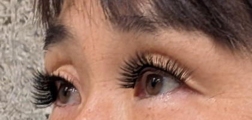
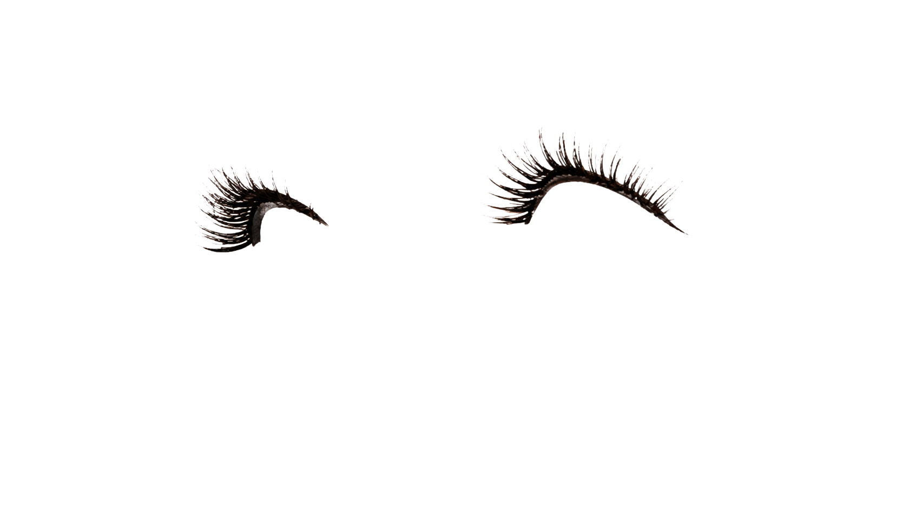
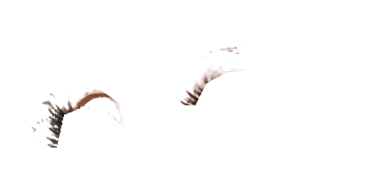

# 生成AIへ単純に切り抜きを依頼した失敗例

## 目的

商品まつ毛を保持する専用処理を使わず、汎用の画像生成AIへ着用写真を渡し、次のような自然言語の指示だけで透過PNGを作らせる方法を試した。

- 両目の上まつ毛だけを残す
- 目、皮膚、眉、髪などを除外する
- 左右の相対位置を維持する
- 背景を透明にする

見た目が自然な「まつ毛画像」は得られたが、実際に販売する商品の切り抜きとしては使えなかった。

参照した目元画像:

この参照画像は、後述する元画素版PNGの透明画素内にも保持されていたRGBを、比較用にAlphaなしで表示したもの。新しい画素の生成や補完はしていない。

## 結果1: 生成AIによる切り抜き

出力は一見きれいだが、セグメンテーション結果ではなく、入力を参考にまつ毛を再生成した画像だった。毛束の本数・間隔、毛先の形、交差、太さ、カールなどが推定で描き直されている。特に左右で大きさとカーブが変わり、元画像の各画素との対応もない。参照画像は420×200pxだが生成結果は1680×936pxであり、元画像の画素を同じ座標で切り出したものでもない。

また、最初の生成結果では透明部分を表す市松模様自体が描かれていたため、記録に残る画像は、その明度をもとに後処理でAlphaへ変換したものだった。この後処理でも、暗い背景が残る、茶色い毛先が薄くなる、といった別の誤差が加わる。

つまり、これは「元写真から商品を抜き出したデータ」ではなく、「元写真に似せて新しく描いた商品画像」である。雰囲気を伝える用途には使えても、実物と異なる商品を見せられないECの商品画像には使えない。

## 結果2: 元画素を使った単純な暗部抽出

生成を避けるため、元画像のRGBを残し、暗い画素ほど不透明にする方法も試した。

こちらは元画素を使うものの、まつ毛と、アイライン・毛根・虹彩・まぶたの影を明るさだけでは分離できない。細い毛先は消え、まぶた付近の不要部分は残るため、商品形状の保存と背景除去を両立できなかった。

## なぜ失敗したか

| 方法 | 保てたもの | 失ったもの |
| --- | --- | --- |
| 生成AIによる切り抜き | 「長く濃いまつ毛」という大まかな印象 | 商品固有の毛束、本数、間隔、毛先、カール、元画素との対応 |
| 元画素の暗部抽出 | 入力画像由来のRGB | 細い毛先、まつ毛と目・肌・アイラインの正しい境界 |

透過PNGであることや、見た目がきれいであることは、商品が保持されている証拠にはならない。生成AIは、見えにくい細線をもっともらしく補完できる一方、その補完が実物と同じであることは保証できない。単純なしきい値処理は描き直しを避けられるが、同じ暗さを持つ目元の別要素を区別できない。

この結果から、本プロジェクトでは商品まつ毛を生成AIへ切り抜かせず、目元ROI、Evidence、Trimap、Alpha Matting、3値ブラシ補正を使って商品領域を抽出する。生成AIは人物側の編集だけに使い、抽出した商品を最後に再合成する。

## この例の位置づけ

これは方式選定のための定性的な失敗例であり、精度評価用ベンチマークではない。実行したモデル名・バージョン・設定と正解マスクが保存されていないため、再現性のある比較やDice等の算出はできない。また、AI自身が回答内で示した「推定・生成された割合」は自己評価であり、計測値としては扱わない。

定量評価については [Synthetic Benchmark](../evaluation/README.md)、採用した静止画処理については [静止画モードの商品まつ毛抽出・再合成アルゴリズム](static-image-algorithm.md) を参照。
