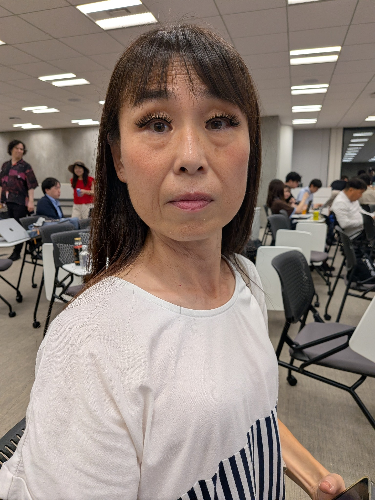
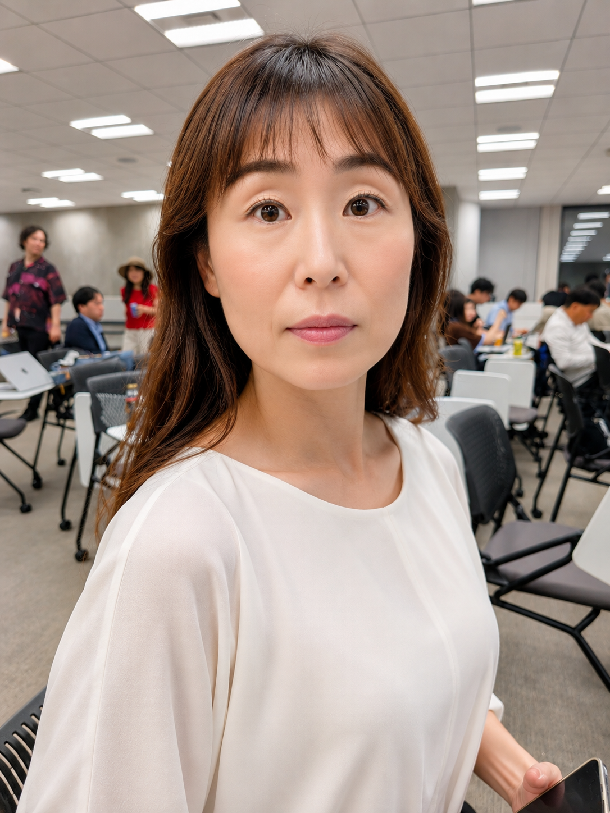
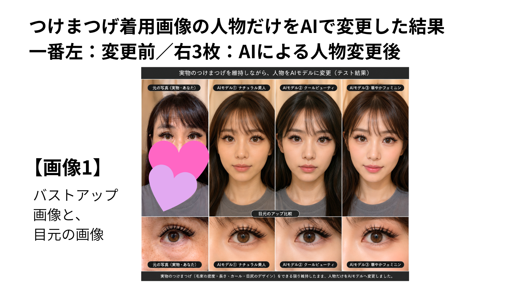
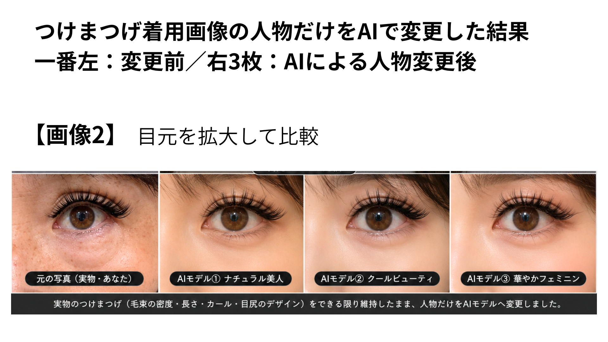
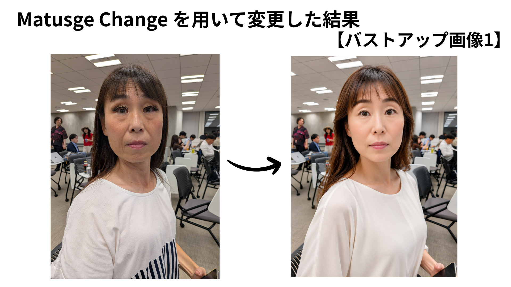
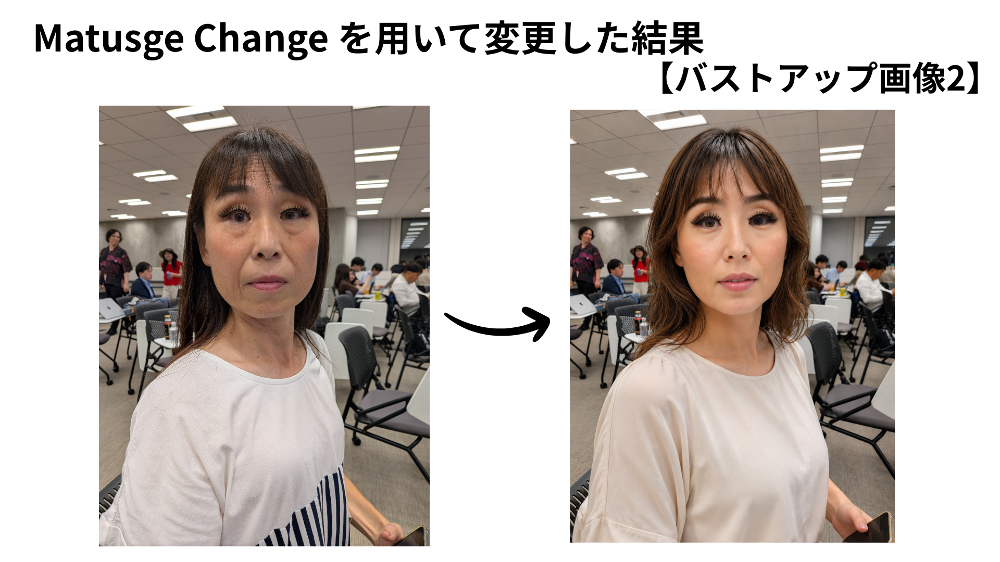
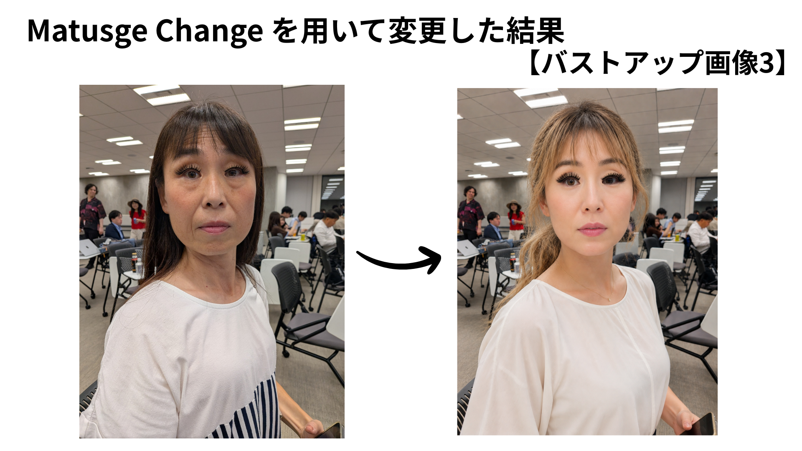
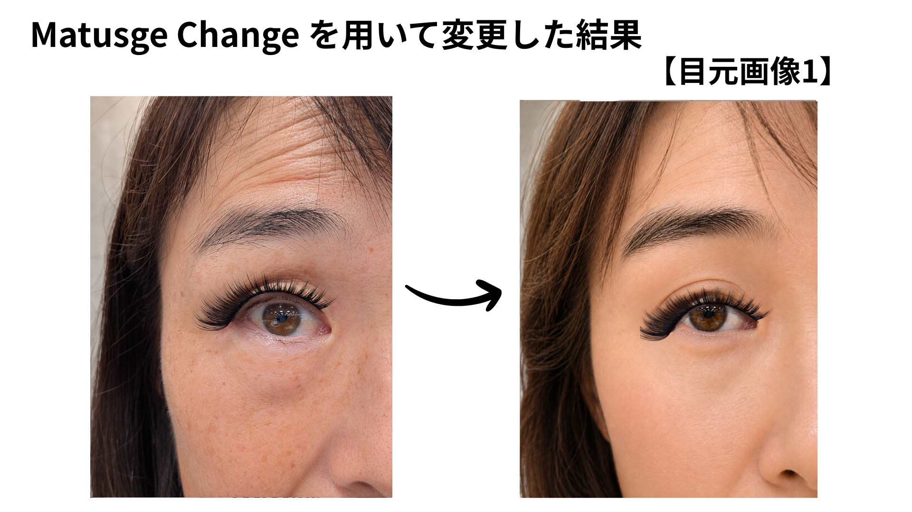
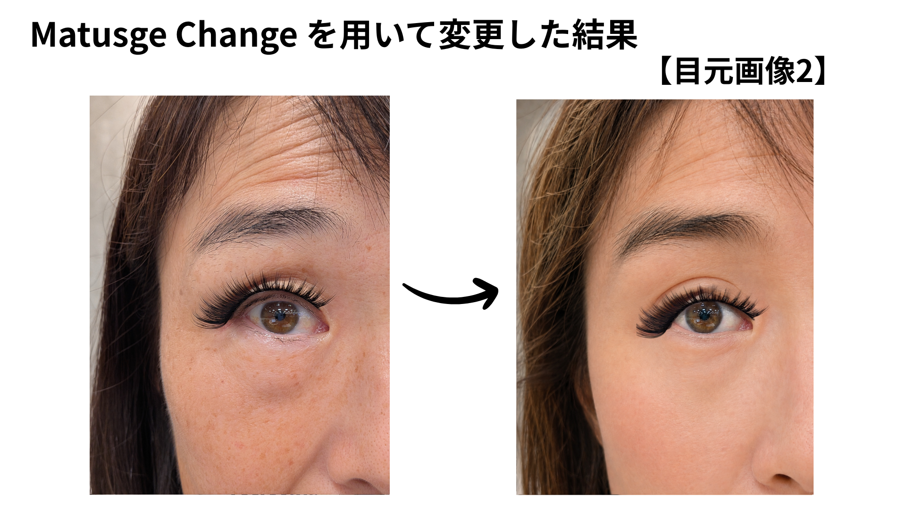

# プロジェクトの背景

## 作りたいもの

`matuge-change` は、EC販売者向けに、商品の着用画像からAIモデルの商品紹介画像・動画を作る
WebアプリのPoCである。

販売者本人やスタッフが実際の商品を着用して撮影し、**商品の見た目をできるだけ維持したまま、
着用人物だけをAIモデルへ変更する**ことを目指す。

> **商品はそのまま、人だけAIモデルへ。**

## なぜ着用画像が必要か

ECでは購入者が実物を手に取れないため、商品単体の写真だけでなく、実際に装着した状態や動きが
購入判断の重要な情報になる。特につけまつげは、次の特徴によって着用時の印象が大きく変わる。

- 毛の長さと毛束の形
- ボリュームとカール
- 目尻側の広がり
- 目元へ装着したときの位置と全体的な見え方

一方、着用画像や動画を継続して制作するには、モデルの手配、日程調整、撮影場所、照明、撮影、
編集などの費用と手間が掛かる。モデルへ商品を送り、自宅で撮影してもらう場合も、照明、距離、
角度、ピント、画質を一定に保つことが難しい。

この課題は、実際にAmazon JPで自己ブランドのつけまつげを販売する中で生まれた。

## 生成AIだけでは解決できなかったこと

「商品は変更せず、人物だけをAIモデルへ変更する」と生成AIへ指示しても、人物と一緒に目元が
再生成され、装着していた商品まで変化することがある。

- まつげの長さが変わる
- 毛束の本数や密度が変わる
- カールや毛先の方向が変わる
- 目尻側のボリュームが変わる
- 元の商品に存在しない毛が生成される

元の着用写真:

生成AIで人物を変更した結果:

見た目が自然でも、実際の商品とは異なる「似た商品」になればECの商品画像には使えない。
掲載画像と届いた商品の違いは、返品、クレーム、低評価、ショップへの信頼低下につながり得る。

商品まつ毛そのものの切り抜きを汎用の画像生成AIへ依頼した場合も、セグメンテーションではなく
再生成になる。[生成AIへ単純に切り抜きを依頼した失敗例](generative-ai-cutout-failure.md) に、
実際の出力と失敗理由を記録している。

## Matsuge Changeの方針

必要なのは「つけまつげを着けたAIモデルを生成する」ことではなく、**実際の商品を保持したまま
人物だけを変更すること**である。

そのため、元の着用画像・動画から商品領域を抽出または保持し、人物を加工した画像へ最後に
再合成する。商品を生成AIへ描き直させない設計の詳細と保証範囲は
[design-philosophy.md](design-philosophy.md) を参照。

実際にMatsuge Changeを用いて変更した結果:

## PoCの対象

今回のPoCでは対象を広げず、Amazonで実際に販売している
[つけまつげ1種類](https://www.amazon.co.jp/dp/B0GFJSHBWT)に絞って実装・検証している。

毛足が長く、細い毛先が多数あるダンス・ステージ用途の商品であり、画像処理として難しい条件に
なる。技術的な難しさは [static-image-algorithm.md](static-image-algorithm.md) の
「対象物としての難しさ」を参照。

## 目指す体験

最終的には、EC販売者が難しい画像編集や動画制作を意識せず、次の流れで商品紹介素材を作れる
ことを目指す。

> **商品を着用する → 撮影する → AIモデルを選ぶ → 商品紹介素材ができる**

PoCではその中でも、「実際の商品をどこまで維持しながら、着用人物だけを変更できるか」という
コア部分の実現と検証を優先している。
