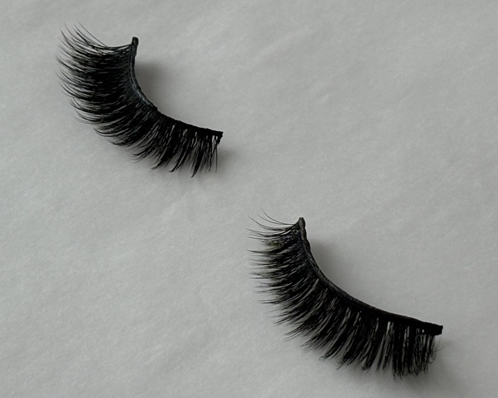
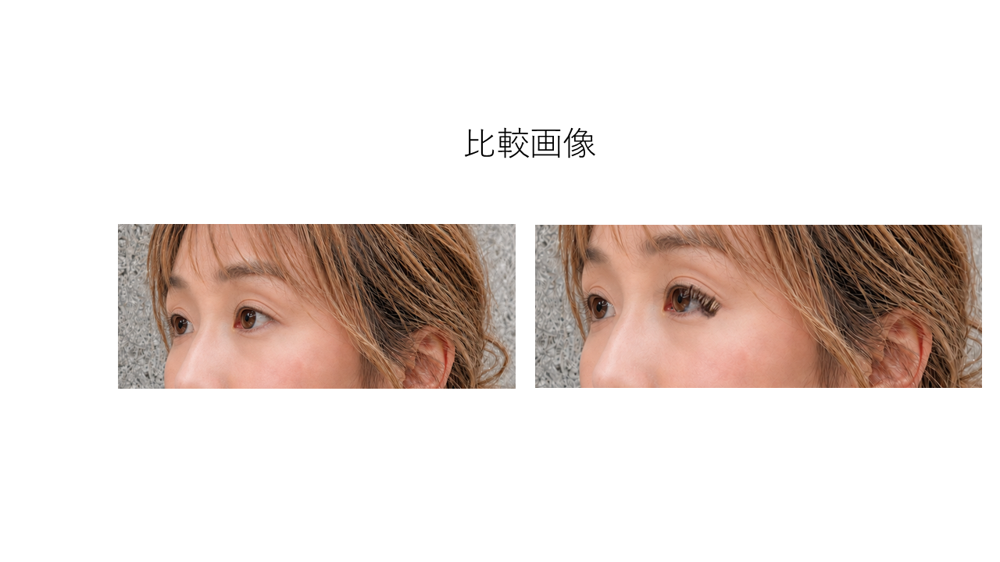

# 静止画モードの商品まつ毛抽出・再合成アルゴリズム

この文書は、`matuge-change` の静止画モードで、着用画像から商品まつ毛を Alpha Matte として抽出し、
AI 加工済み画像へ再合成する現行アルゴリズムを説明する。

対象コードは主に `backend/lash_extraction/`（`landmarks.py` / `roi.py` / `alignment.py` /
`evidence.py` / `matting.py` / `product.py`）と、それを合成する `backend/api/`。

設計判断・却下案の経緯は [handover.md](handover.md)、動画モードとの違いは
[video-algorithm.md](video-algorithm.md) を参照。

## 対象物としての難しさ

今回の対象商品は、毛足が長く、細い毛先が多数存在するダンス・ステージ用途のつけまつ毛である。



画像処理上は次の特徴がある。

- 毛先が数ピクセル以下の細線になる
- 毛先が背景色と混ざり、完全な Foreground ではない
- 毛同士の間に細かな Background 領域が存在する
- 根元と毛先で密度・不透明度が大きく異なる
- 着用時には自まつ毛・アイライン・まぶたと重なる
- 影や照明変化も商品候補として誤検出しやすい

そのため、単純な二値セグメンテーションよりも
Foreground / Unknown / Background を持つ Trimap と Alpha Matting が適している。

## 1. 全体フロー

```text
装着画像 image_with （＋任意で未装着画像 image_without）
        ↓
MediaPipe Face Landmarker（478点）
        ↓
左右の目ランドマーク → 目元 ROI（自動 / 手動矩形）
        ↓
未装着画像あり: Landmark Affine + ECC で位置合わせ
        ↓
Evidence Map
  あり: Difference（暗化 60% + 色差 15% + エッジ差 25%）
  なし: 局所暗部（Darkness）フォールバック
        ×
Eye Prior（目ポリゴンを拡張・ぼかした空間事前分布）
        ↓
Probability Map
        ↓
3値ブラシ補正（＋商品 / ？中間 / −背景）
        ↓
Trimap（255 FG / 128 Unknown / 0 BG）
        ↓
Closed-form Alpha Matting + Foreground 推定（pymatting）
        ↓
Product RGBA（商品まつ毛レイヤー）
        ↓
AI 加工済み画像へ相似変換（Landmark Affine）+ Alpha Blend
        ↓
再合成結果 / 再構成誤差（MAE）
```

抽出の入口と出口は次のようになる。




## 2. 顔ランドマーク

実装: `backend/lash_extraction/landmarks.py`

MediaPipe Face Landmarker（`models/face_landmarker.task`, `num_faces=1`）で 478 点を検出し、
画像ピクセル座標へ変換する。

用途ごとに使う点を分けている。

| 定数 | 内容 | 用途 |
| --- | --- | --- |
| `RIGHT_EYE` / `LEFT_EYE` | 左右の目輪郭 16 点ずつ | ROI・Eye Prior |
| `ALIGN_POINTS` | 左右の目輪郭 + 鼻筋・鼻孔周辺の 10 点 | 装着/未装着の位置合わせ、AI 画像への再合成 |

顔が検出できない画像（大きな横顔、目元のクローズアップなど）では、ユーザーが元画像座標で
矩形を指定する手動 ROI（`manual_eye_roi`）を使う。

## 3. 目元 ROI

実装: `backend/lash_extraction/roi.py`

すべての抽出処理は、元画像全体ではなく目元 ROI の座標系で行う。まつ毛は目輪郭より上・外側へ
伸びるため、マージンは上方向に大きい非対称な矩形にしている。

```text
eye_pts = landmarks[LEFT_EYE + RIGHT_EYE] の外接矩形（幅 ew / 高さ eh）

x0 = ex0 - 0.45 × ew
x1 = ex1 + 0.45 × ew
y0 = ey0 - 2.40 × eh
y1 = ey1 + 1.40 × eh
```

ROI 幅が `MAX_ROI_WIDTH = 1100` を超える場合は `scale = 1100 / 幅` で縮小する
（`INTER_AREA`）。以降のレイヤー（Probability / Trimap / Alpha / Product RGBA）は
すべてこの ROI 解像度で保持され、ブラシ座標系もこれに一致する。

`EyeRoi(x0, y0, x1, y1, scale)` は再合成時に ROI 座標 → 元画像座標へ戻すためにも使う。

## 4. 位置合わせ（未装着画像がある場合）

実装: `backend/lash_extraction/alignment.py`

未装着画像 B を装着画像 A の座標へ合わせる。

1. `estimateAffinePartial2D(lms_b[ALIGN_POINTS], lms_a[ALIGN_POINTS], method=LMEDS)`
   で相似変換を推定し `warpAffine`（推定失敗時は単位行列）
2. 目元 ROI を切り出した後、`findTransformECC`（`MOTION_EUCLIDEAN`, 100 反復, eps 1e-5,
   gaussFiltSize 5）でサブピクセル精度の微調整（`cv2.error` 時は補正なしで続行）

ROI 内に限定して ECC を掛けるのは、顔全体では表情差・髪の動きが最適化を支配してしまい、
まつ毛の差分だけを見たい目元の位置が合わないため。

## 5. Evidence Map と Probability

実装: `backend/lash_extraction/evidence.py`

各 Evidence は `_norm_percentile`（50〜99.5 パーセンタイルで正規化、レンジが 1e-3 未満なら
ノイズとみなし全ゼロ）で `[0, 1]` に揃える。

### 5.1 Difference Map（未装着画像あり）

Lab 色空間で、装着画像 A と位置合わせ済み未装着画像 B を比較する。

| 手がかり | 計算 | 重み |
| --- | --- | --- |
| 暗化 | `clip(L_b - L_a, 0, None)` | 0.60 |
| 色差 | `‖(a,b)_a - (a,b)_b‖` | 0.15 |
| エッジ差 | `clip(|∇A| - |∇B|, 0, None)`（Sobel 勾配強度） | 0.25 |

まつ毛は黒く細いので、「A が B より暗くなった」ことが最も強い手がかりになる。色差は
メイクや影の色変化、エッジ差は細線構造の増加を拾う。

### 5.2 Darkness Map（未装着画像なし）

未装着画像が無い場合は差分が取れないため、局所暗部をフォールバックの Evidence にする。

```text
darkness = clip(GaussianBlur(gray, sigma=8) - gray, 0, None)
```

周囲より暗い細い構造（まつ毛・アイライン・二重の陰など）が残る。差分方式より特異性は低い。

### 5.3 Eye Prior

左右の目ポリゴンを `fillPoly` で塗り、`eye_h = max(4, 0.045 × ROI幅)` の楕円カーネルで
2 回 dilate、`sigma = eye_h × 0.8` の Gaussian でぼかし、`× 1.4` して `[0, 1]` に clip する。

目から離れた髪・眉・背景の暗部や照明変化を Evidence から落とすための空間事前分布。

### 5.4 Probability

```text
probability = clip(evidence × prior, 0, 1)
```

これがユーザーに提示される初期推定であり、ブラシ補正の出発点になる。

## 6. 3値ブラシ補正と Trimap

実装: `backend/lash_extraction/matting.py::build_trimap`、`backend/strokes/`

Probability から Trimap（`uint8`: 255 = FG / 128 = Unknown / 0 = BG）を作る。

```text
fg      = probability >= fg_thresh   （既定 0.70）
maybe   = probability >= bg_thresh   （既定 0.18）
unknown = dilate(maybe, ellipse(unknown_band_px=6))
```

Unknown を `maybe` の膨張で作るのは、毛先が「背景と混ざった半透明画素」であり、閾値では
FG/BG を決められないため。決めずに Matting へ渡すのが目的である。

ユーザーのブラシ制約（`constraints`: `+1` 商品 / `2` 中間 / `-1` 背景）は閾値より優先される。
「？中間」ブラシは該当画素を Unknown へ強制し、境界の判断を Matting に任せる。
ストロークはベクタとして保存され、セッション再開時に再現できる。

## 7. Alpha Matting

実装: `backend/lash_extraction/matting.py::run_matting`

pymatting の Closed-form Matting（`estimate_alpha_cf`）で Alpha を解き、
`estimate_foreground_ml` で Foreground RGB を推定する。前景色を推定するのは、毛先の画素が
背景と混色しており、元画素をそのまま使うと合成先で背景色が乗ってしまうため。

出力は Alpha（float）と Foreground BGR（float）で、これを `Product RGBA` として保存する。

Trimap が退化している場合（Unknown が無い / FG か BG のラベルが無い）は pymatting が例外を
出すため、Trimap から直接 Alpha を作って返す。

### 7.1 solve モード（メモリ）

Closed-form Matting のピークメモリは解く画素数に比例する（実測 約 3MB / 1000px、
依存ライブラリの常駐が約 290MB）。

| モード | 内容 |
| --- | --- |
| `full`（既定） | ROI 全体を 1 つの線形系で解く。品質優先で、従来と同じ出力 |
| `tiled` | 商品周辺の solve window（`solve_window`, 余白 32px）をタイル分割して解く低メモリ近似 |

`tiled` では 1 solve あたりの画素数を `MATTE_MAX_SOLVE_PIXELS`（既定 60,000）で必ず抑える。
各タイルは周囲の context（`_label_aware_context`）付きで解き、書き戻すのはタイル本体だけなので
タイル境界が Alpha の継ぎ目になりにくい。タイル内に FG/BG 両ラベルが無い場合は上限内で
context を広げ、届かなければ縦長／横長の帯へ変形し、さらにタイルを分割して探す。
どうしても届かない場合は Unknown を 0/1 に潰さず**設定エラー**にする。

解像度を下げて解く案を採らないのは、毛先の細線の Alpha が潰れて抽出の意味が失われるため。
環境変数と運用ログは [../README.md](../README.md#matting-のメモリ設定環境変数) を参照。

## 8. 再合成

実装: `backend/lash_extraction/matting.py::recompose_onto` / `blend_rgba_over`

抽出した Product RGBA（ROI 座標系）を、AI 加工済み画像へ貼る。

```text
ROI 座標
  ↓ scale の逆数 + (x0, y0) 平行移動
装着画像座標
  ↓ estimateAffinePartial2D(lms_worn → lms_edited, LMEDS)
AI 加工済み画像座標
  ↓ warpAffine(INTER_LINEAR, border = 透明)
Alpha Blend（横ストライプ分割の float64 演算）
```

2 つの変換を 3x3 行列で合成してから 1 回だけ `warpAffine` するため、補間は 1 回で済む。

商品領域に許すのは **相似変換（移動・縦横比固定の拡縮・回転・反転）だけ**である。
`estimateAffinePartial2D` は相似変換しか返さないので、毛足の長さ・毛束の間隔・カールの
縦横比は変わらない。自由変形・パースペクティブ・非相似 warp は行わない。

AI 加工済み画像で顔が検出できない場合、または変換が推定できない場合は `None` を返す
（黙って位置のずれた合成を出さない）。

## 9. 品質の確認

- `reconstruction_error`（`backend/lash_extraction/matting.py`）— 抽出した Alpha と
  Foreground を元の装着画像へ合成し直したときの `alpha > 0.05` 領域の MAE（0〜255）。
  Matting が元の見た目を再現できているかの指標
- `product_bbox`（`backend/lash_extraction/product.py`）— Alpha 前景の外接矩形。
  面積比 0.05% 未満の連結成分を除いてノイズを拾わない
- Synthetic Benchmark（`evaluation/`）— 正解 Alpha が既知の合成データで IoU / Dice /
  RGB fidelity を計測する。**数値の読み方（A/B/C 層）は
  [../evaluation/README.md](../evaluation/README.md) §0 に従う**

## 10. 現行方式の弱点

- 未装着画像が無い場合、Evidence が局所暗部だけになり、アイライン・二重の陰・眉と
  区別しにくい
- 装着/未装着で表情・照明が大きく変わると Difference が商品以外を拾う
- Eye Prior は目ポリゴンの拡張であり「ここまでが商品」を意味的に認識してはいない
- 顔検出に失敗する構図（大きな横顔・クローズアップ）では手動 ROI 指定が必要
- ROI 幅 1100px への縮小と再合成の補間があるため、ピクセル単位の一致は保証しない
  （保持強度の定義は [../README.md](../README.md) 「商品保持の考え方」）

## 11. コード対応表

| 処理 | 実装 |
| --- | --- |
| 顔ランドマーク | `backend/lash_extraction/landmarks.py::detect_landmarks` |
| 目元 ROI | `backend/lash_extraction/roi.py::compute_eye_roi` / `manual_eye_roi` |
| Landmark Affine | `backend/lash_extraction/alignment.py::align_b_to_a` |
| ECC 微調整 | `backend/lash_extraction/alignment.py::ecc_refine` |
| Difference Map | `backend/lash_extraction/evidence.py::difference_map` |
| 局所暗部フォールバック | `backend/lash_extraction/evidence.py::darkness_map` |
| Eye Prior | `backend/lash_extraction/evidence.py::eye_prior` |
| Probability | `backend/lash_extraction/evidence.py::initial_probability` |
| Trimap | `backend/lash_extraction/matting.py::build_trimap` |
| Alpha Matting | `backend/lash_extraction/matting.py::run_matting` |
| 再合成 | `backend/lash_extraction/matting.py::recompose_onto` |
| 再構成誤差 | `backend/lash_extraction/matting.py::reconstruction_error` |

## 12. 関連ドキュメント

- [../README.md](../README.md) — プロジェクト全体の目的と静止画 / 動画の技術比較
- [design-philosophy.md](design-philosophy.md) — なぜ商品を生成AIに任せないのか
- [video-algorithm.md](video-algorithm.md) — 動画モードの目元保持・再合成
- [handover.md](handover.md) — 設計判断と既知の落とし穴
- [benchmark-findings.md](benchmark-findings.md) — Benchmark で分かった課題
- [ai-editing-api.md](ai-editing-api.md) — AI モデル加工の API 選定と Adapter 設計
